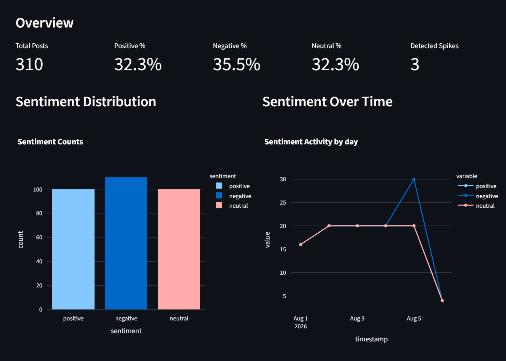
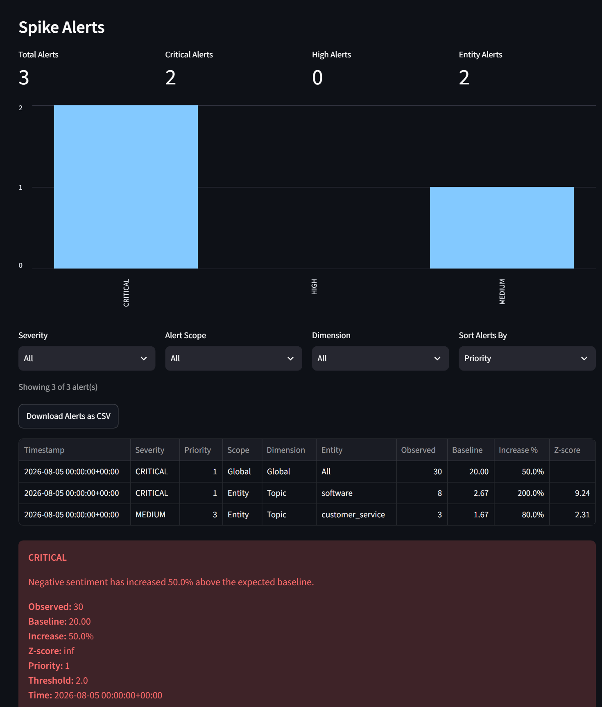
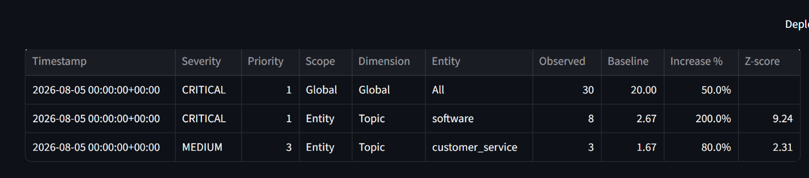
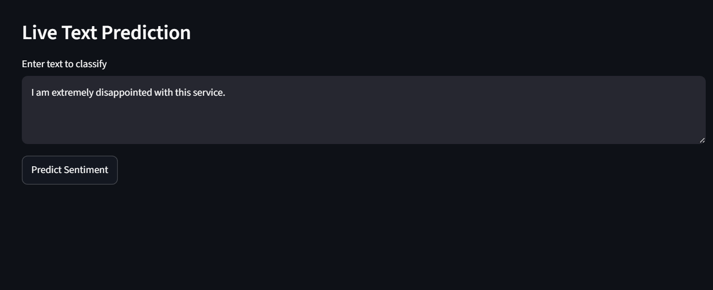

# SentimentScope AI

> **Local-first social media sentiment monitoring, entity-aware anomaly detection, and spike alerting platform with an interactive Streamlit dashboard.**

[](https://www.python.org/)
[](https://docs.pytest.org/)
[](https://github.com/astral-sh/ruff)
[](https://streamlit.io/)
[](LICENSE)

---

## Executive Summary

Organizations face significant operational and reputational risk when negative customer sentiment surges undetected across digital channels. **SentimentScope AI** is an end-to-end sentiment intelligence and monitoring platform designed to ingest multi-platform social text, clean noisy conversational data, evaluate classical machine learning models with strict leak-free methodologies, extract fine-grained entities (brands, products, operational topics), detect statistical anomalies using rolling time-series baselines, deliver explainable AI insights with root-cause correlation, and present actionable alerts through an interactive, filterable Streamlit dashboard.

---

## Problem & Solution

| The Problem | The SentimentScope AI Solution |
| :--- | :--- |
| **Noisy Social Data**: Raw social posts contain URLs, hashtags, user mentions, and elongation that degrade NLP model quality. | **Modular Preprocessing Engine**: Specialized cleaning pipeline strips web noise while preserving sentiment tokens and normalizing character elongation. |
| **Data Leakage in Model Evaluation**: Naive preprocessing and vectorization across full datasets inflate reported ML accuracy. | **Strict Leak-Free Pipeline**: Stratified 80/20 train/test splits where TF-IDF vectorizers and classifiers are fit exclusively on training data. |
| **Superficial Sentiment Metrics**: Aggregated sentiment scores hide isolated crises impacting specific products or brands. | **Entity-Aware Extraction & Tracking**: Discovers Brand, Product, and Topic dimensions using dictionary matching and spaCy NER fallback. |
| **False-Alarm Anomaly Detection**: Static thresholds fail to adapt to organic volume shifts across time of day or week. | **Lagged Rolling Z-Score Baselines**: Dynamic rolling statistical window ($w=3$) detects statistically significant sentiment surges with graded severity (`CRITICAL`, `HIGH`, `MEDIUM`). |
| **Opaque Alert Notifications**: Raw z-scores and volume alerts leave stakeholders without clear explanations of root-cause drivers or trajectory. | **Explainable AI Insight Engine**: Translates anomalies into business-friendly natural explanations, classifying macro sentiment trajectory (Improving, Stable, Declining, Volatile) and isolating root-cause topics. |
| **Unactionable Dashboards**: Monolithic dashboards lack diagnostic drill-down, alert prioritization, and export workflows. | **Interactive Operations Dashboard**: Comprehensive UI with multi-criteria filtering, priority sorting, alert severity charts, structured history tables, and CSV export. |

---

## Key Features

- **Multi-Dataset Support**: Seamless runtime switching between a synthetic multi-platform dataset (310 records with injected anomaly) and a real-world Twitter US Airline dataset (14,485 deduplicated records).
- **Leak-Free Machine Learning**: Evaluates **Logistic Regression** vs. **Linear SVM** side-by-side with stratified validation, reporting Accuracy, Weighted Precision, Recall, and F1 Score.
- **Dataset-Isolated Model Persistence**: Individual model persistence paths (`sentiment_model_sample.joblib`, `sentiment_model_realistic.joblib`) prevent cross-dataset contamination.
- **Entity Detection Engine**: Maps social conversations into three operational dimensions—**Brand**, **Product**, and **Topic**—using exact token boundaries, alias normalization, and spaCy NER fallback.
- **Time-Series & Dimensional Aggregation**: Aggregates volume and sentiment distributions across temporal buckets (hourly, daily) and entity dimensions.
- **Multi-Level Spike Detection**:
  - **Global Spikes**: Detects macro-level surges in negative sentiment across the entire stream.
  - **Entity Spikes**: Detects targeted negative sentiment surges isolating specific brands, products, or topics.
- **Severity Graded & Prioritized Alerts**: Emits deduplicated alert records with statistical z-scores, percentage increase above baseline, and priority tiers (`1: CRITICAL`, `2: HIGH`, `3: MEDIUM`).
- **Explainable AI Insight Engine**:
  - **Macro Sentiment Trajectory**: Classifies timeline movement into `Improving`, `Stable`, `Declining`, or `Highly Volatile` without lookahead leakage.
  - **Multi-Factor Explainable Severity**: Deterministic scoring across `CRITICAL`, `HIGH`, `MEDIUM`, and `LOW` tiers combining statistical z-scores, negative sentiment concentration, and volume surges.
  - **Spike Root-Cause Correlation**: Automatically isolates co-occurring topic and entity drivers explaining *why* an anomaly occurred.
  - **Disproportionate Friction Hotspots**: Discovers brands, products, and topics dominating negative complaint volume.
  - **Business-Friendly Narrative Cards & Briefings**: Provides executive-ready explanations and structured summaries.
- **Interactive Operations Dashboard**:
  - Top-level overview and alert metric cards (`Total`, `Critical`, `High`, `Entity Alerts`).
  - Severity distribution bar chart.
  - Multi-criteria filter controls (Severity, Scope, Dimension).
  - Multi-criteria sorting (Priority, Latest, Increase %, Z-score).
  - Formatted alert history table with dedicated column configs.
  - One-click CSV export of filtered alert records.
  - Live single-text sentiment prediction inference tool.

---

## Technology Stack

- **Core Language**: Python 3.12
- **Machine Learning & NLP**: `scikit-learn` (TF-IDF, Logistic Regression, LinearSVC), `spaCy` (`en_core_web_sm`), `joblib`
- **Data Engineering & Analytics**: `pandas`, `numpy`
- **Visualization & UI**: `streamlit` (1.61+), `plotly` (express & graph objects)
- **Code Quality & Testing**: `pytest`, `ruff` (linter and code formatter)

---

## System Architecture & Data Flow

```text
┌─────────────────────────────────────────────────────────────────────────────┐
│                                Data Layer                                   │
│  • Synthetic Multi-Platform Dataset (sample_data.csv - 310 records)         │
│  • Real-World Twitter US Airline Dataset (realistic_social_data.csv - 14.5k)│
└──────────────────────────────────────┬──────────────────────────────────────┘
                                       │
                                       ▼
┌─────────────────────────────────────────────────────────────────────────────┐
│                 Data Loader & Schema Validation (src/data_loader.py)        │
│           ID de-duplication, timestamp validation, 5-column schema           │
└──────────────────────────────────────┬──────────────────────────────────────┘
                                       │
                                       ▼
┌─────────────────────────────────────────────────────────────────────────────┐
│                 Preprocessing Pipeline (src/preprocessing/)                 │
│      HTML entity decode, @mention strip, hashtag normalize, elongation      │
└──────────────────┬───────────────────┬───────────────────┬──────────────────┘
                   │                   │                   │
                   ▼                   ▼                   ▼
┌────────────────────────┐┌────────────────────────┐┌────────────────────────┐
│    Machine Learning    ││    Entity Detection    ││ Time-Series Aggregation│
│   (src/sentiment/)     ││(src/entity_detection/) ││ (src/aggregation/ & TS)│
│────────────────────────││────────────────────────││────────────────────────│
│• Stratified 80/20 Split││• Brand, Product, Topic ││• Hourly/Daily Resample │
│• Train-Only TF-IDF Fit ││• Curated Dictionaries  ││• Dimension-Level Series│
│• Logistic Reg & SVM    ││• spaCy NER Fallback    ││• Weighted Sentiment Avg│
└───────────┬────────────┘└───────────┬────────────┘└───────────┬────────────┘
            │                         │                         │
            │                         └────────────┬────────────┘
            │                                      │
            ▼                                      ▼
┌────────────────────────┐           ┌───────────────────────────────────────┐
│   Model Evaluation &   │           │        Statistical Spike Engine       │
│ Dataset-Isolated Cache │           │   (src/spike_detection.py & entity)   │
│────────────────────────│           │───────────────────────────────────────│
│• Accuracy, F1, Recall  │           │• Lagged Rolling Baseline (w=3)        │
│• Confusion Matrix      │           │• Rolling Mean & Std Dev               │
│• Isolated .joblib files│           │• Global & Entity Z-Score Spikes       │
└───────────┬────────────┘           └───────────────────┬───────────────────┘
            │                                            │
            │                                            ▼
            │                        ┌───────────────────────────────────────┐
            │                        │        Alert Engine (src/alerts.py)   │
            │                        │───────────────────────────────────────│
            │                        │• Severity Grading (CRITICAL/HIGH/MED) │
            │                        │• Priority (1/2/3) & Increase % Calc   │
            │                        │• Multi-Key Deduplication              │
            └────────────────────┬───┴───────────────────────────────────────┘
                                 │
                                 ▼
┌─────────────────────────────────────────────────────────────────────────────┐
│                 Explainable AI Insight Layer (src/insights/)                │
│  • Macro Sentiment Trajectory (Improving, Stable, Declining, Volatile)      │
│  • Multi-Factor Explainable Severity Scoring (CRITICAL, HIGH, MEDIUM, LOW)  │
│  • Spike Root-Cause Correlation (co-occurring topics & brands)              │
│  • Negative Sentiment Concentration Hotspot Analytics                       │
│  • Business-Friendly Formatter & Executive Briefing Generator               │
└──────────────────────────────────────┬──────────────────────────────────────┘
                                       │
                                       ▼
┌─────────────────────────────────────────────────────────────────────────────┐
│                         Streamlit Web Dashboard (app.py)                    │
│  • Dataset Selection & Model Comparison Benchmarks                          │
│  • Sentiment Distributions, Timeline Trend Lines, & Platform Breakdown     │
│  • Dedicated AI Insights Section (Trajectory, Cards, Diagnostics)           │
│  • 4x Alert Summary Metrics & Severity Distribution Chart                   │
│  • Dynamic Filters (Severity, Scope, Dimension) & Multi-Criteria Sort       │
│  • Formatted History Table, CSV Export, & Severity-Styled Alert Cards       │
│  • Real-Time Single-Text Inference Sandbox                                  │
└─────────────────────────────────────────────────────────────────────────────┘
```

---

## Project Structure

```text
SentimentScope AI/
├── data/
│   ├── raw/
│   │   └── Tweets.csv                  # Raw Twitter US Airline Sentiment data (Kaggle)
│   ├── processed_data.csv              # Initial processed dataset artifact
│   ├── realistic_social_data.csv       # Cleaned real-world dataset (14,485 rows)
│   └── sample_data.csv                 # Synthetic development dataset (310 rows)
├── models/
│   └── .gitkeep                        # Holds dataset-isolated .joblib models
├── scripts/
│   ├── generate_sample_data.py         # Generates deterministic sample data with spike
│   └── prepare_realistic_data.py       # Cleans & normalizes raw Twitter airline data
├── src/
│   ├── aggregation/                    # Multi-dimensional time-series aggregation
│   │   ├── __init__.py
│   │   └── aggregator.py               # Hourly/daily aggregation by entity dimensions
│   ├── data_collection/                # Ingestion loaders & normalized schema
│   │   ├── __init__.py
│   │   ├── base_loader.py              # Base loader interface
│   │   ├── instagram_loader.py         # Instagram schema normalizer
│   │   ├── json_loader.py              # Generic JSON dataset loader
│   │   ├── reddit_loader.py            # Reddit schema normalizer
│   │   ├── twitter_loader.py           # Twitter schema normalizer
│   │   └── youtube_loader.py           # YouTube schema normalizer
│   ├── entity_detection/               # Brand, Product, and Topic extraction
│   │   ├── __init__.py
│   │   ├── detector.py                 # Hybrid dictionary + spaCy NER detector
│   │   ├── dictionaries.py             # Domain entity lexicons & aliases
│   │   └── normalizer.py               # Canonical entity normalization
│   ├── insights/                       # Explainable AI insight engine
│   │   ├── __init__.py
│   │   ├── analyzer.py                 # Macro trend & spike driver correlation
│   │   ├── formatter.py                # Executive text & briefing cards
│   │   └── severity.py                 # Multi-factor explainable severity scoring
│   ├── preprocessing/                  # Text cleaning & normalization
│   │   ├── __init__.py
│   │   └── cleaner.py                  # HTML, URL, mention, hashtag, elongation cleaner
│   ├── sentiment/                      # Sentiment classification pipelines
│   │   ├── __init__.py
│   │   ├── evaluator.py                # Stratified model comparison & classification report
│   │   ├── model.py                    # TF-IDF + Logistic Regression / Linear SVM pipelines
│   │   └── scorer.py                   # Continuous polarity scoring
│   ├── time_series/                    # Temporal bucketing & trend generation
│   │   ├── __init__.py
│   │   └── builder.py                  # Hourly & daily sentiment bucket generator
│   ├── alerts.py                       # Alert formatting, severity, priority, & deduplication
│   ├── data_loader.py                  # CSV loading & schema validation
│   ├── entity_spike_detection.py       # Entity-level negative sentiment spike detection
│   ├── insights.py                     # Top-level explainable insights facade
│   ├── preprocessing.py                # Top-level preprocessing entry point
│   ├── sentiment.py                    # Top-level sentiment entry point
│   └── spike_detection.py              # Global time-series rolling z-score spike detector
├── tests/
│   ├── conftest.py                     # Shared Pytest fixtures & sample generators
│   ├── test_aggregation.py             # Tests for multi-dimensional aggregation
│   ├── test_alerts.py                  # Tests for alert generation, priority, & deduplication
│   ├── test_compare_models.py          # Tests for model comparison & stratified splits
│   ├── test_data_collection.py         # Tests for platform ingestion loaders
│   ├── test_data_loader.py             # Tests for CSV loading & schema validation
│   ├── test_entity_detection.py        # Tests for dictionary & spaCy entity discovery
│   ├── test_entity_spike_detection.py  # Tests for entity-specific spike detection
│   ├── test_insights.py                # Tests for Phase 7 AI insight engine & severity
│   ├── test_preprocessing.py           # Tests for regex cleaning & character compression
│   ├── test_sentiment.py               # Tests for model training, prediction, & persistence
│   ├── test_spike_detection.py         # Tests for rolling z-score calculations
│   └── test_time_series.py             # Tests for temporal bucketing & time series
├── app.py                              # Main interactive Streamlit application
├── config.py                           # Project-wide constants & settings
├── requirements.txt                    # Production & test dependencies
└── README.md                           # Documentation
```

---

## Data Pipelines & Schemas

### Standard 5-Column Schema (`src/data_loader.py`)

All primary datasets strictly comply with this validated schema:

| Column | Type | Description | Constraints |
| :--- | :--- | :--- | :--- |
| `id` | String | Unique record identifier | Non-empty, unique across dataset |
| `platform` | String | Social media source (e.g., `Twitter`, `Reddit`, `YouTube`) | Non-empty string |
| `text` | String | Raw post content | Non-empty string |
| `timestamp` | Datetime | Post creation timestamp | ISO / standard datetime string |
| `sentiment` | String | Ground-truth sentiment label | Strictly `positive`, `negative`, or `neutral` |

### Multi-Platform Ingestion Schema (`src/data_collection/`)

The modular ingestion engine supports extending datasets into a normalized 12-field schema covering `post_id`, `platform`, `timestamp`, `author`, `text`, `brand`, `product`, `topic`, `sentiment`, `sentiment_score`, `engagement_metrics`, and `provenance`.

---

## Machine Learning & Benchmark Results

### Methodology
1. **Train/Test Split**: 80/20 stratified split by sentiment class (`random_state=42`).
2. **Feature Extraction**: `TfidfVectorizer(max_features=5000, ngram_range=(1, 2))` fit **strictly on training data**.
3. **Classifiers**:
   - `LogisticRegression(max_iter=1000, class_weight="balanced", random_state=42)`
   - `LinearSVC(C=1.0, class_weight="balanced", random_state=42)`

### Performance Benchmarks

#### 1. Synthetic Development Dataset (`data/sample_data.csv`, Test Size = 62)
| Model | Accuracy | Precision (Weighted) | Recall (Weighted) | F1 Score (Weighted) | Best Model |
| :--- | :---: | :---: | :---: | :---: | :---: |
| **Logistic Regression** | 0.9839 | 0.9845 | 0.9839 | 0.9839 | Tied |
| **Linear SVM** | 0.9839 | 0.9845 | 0.9839 | 0.9839 | Tied |

*Note: High performance reflects formulaic synthetic validation sentences with an intentional spike.*

#### 2. Realistic Twitter US Airline Dataset (`data/realistic_social_data.csv`, Test Size = 2,897)
| Model | Accuracy | Precision (Weighted) | Recall (Weighted) | F1 Score (Weighted) | Best Model |
| :--- | :---: | :---: | :---: | :---: | :---: |
| **Logistic Regression** | **0.7746** | **0.7906** | **0.7746** | **0.7804** | **Selected** |
| **Linear SVM** | 0.7746 | 0.7762 | 0.7746 | 0.7752 | - |

---

## Statistical Spike Detection & Alert Engine

```text
Lagged Rolling Window (w = 3) ──► Rolling Mean (μ) & Std (σ) ──► Z-Score = (Observed - μ) / σ
                                                                             │
┌─────────────────────────────── Alert Engine ───────────────────────────────┘
│
├── Severity Assignment:  z ≥ 4.0 ──► CRITICAL  |  3.0 ≤ z < 4.0 ──► HIGH  |  2.0 ≤ z < 3.0 ──► MEDIUM
├── Priority Assignment:  CRITICAL ──► Priority 1 | HIGH ──► Priority 2 | MEDIUM ──► Priority 3
├── Percentage Increase:  ((Observed - Baseline) / Baseline) * 100
├── Deduplication:        Filters duplicates by (timestamp, alert_type, dimension, entity)
└── Global & Entity Scope: Evaluated across macro stream and per Brand / Product / Topic
```

---

## Explainable AI Insight Engine & Severity Methodology

Phase 7 introduces an explainable AI layer on top of statistical anomaly detection and entity recognition. Rather than relying on external, opaque LLMs or paid APIs, the insight engine utilizes deterministic, empirical methods to turn numerical alerts into clear, actionable business intelligence:

### 1. Macro Sentiment Trajectory Classification
Analyzes chronological net sentiment ($S_{net} = R_{positive} - R_{negative}$) across time periods without lookahead bias:
- **`Improving`**: Net sentiment shifts upward by $\ge +0.05$ from initial baseline to recent periods.
- **`Declining`**: Net sentiment shifts downward by $\le -0.05$ from initial baseline to recent periods.
- **`Highly Volatile`**: High periodic volatility ($\sigma \ge 0.25$) with significant detrended residual variance ($\sigma_{res} \ge 0.20$) or frequent sign alternations across periods ($n \ge 3$).
- **`Stable`**: Minor fluctuations within the $[-0.05, +0.05]$ boundary.

### 2. Multi-Factor Explainable Severity Scoring
Combines statistical deviation, volume weight, and negative concentration:
- **`CRITICAL`** (Priority 1): $z \ge 4.0$ (or infinite spike), OR ($z \ge 3.0$ with $\ge 10$ negative posts and negative ratio $\ge 70\%$), OR (surge $\ge 100\%$ with $\ge 20$ negative posts and negative ratio $\ge 60\%$).
- **`HIGH`** (Priority 2): $z \in [3.0, 4.0)$, OR ($z \ge 2.0$ with $\ge 5$ negative posts and negative ratio $\ge 60\%$), OR (surge $\ge 50\%$ with $\ge 5$ negative posts and negative ratio $\ge 50\%$).
- **`MEDIUM`** (Priority 3): $z \in [2.0, 3.0)$, OR negative ratio $\ge 40\%$ with $\ge 5$ negative posts, OR (surge $\ge 25\%$ with negative ratio $\ge 40\%$).
- **`LOW`** (Priority 4): Sub-threshold fluctuations, low volume, or predominantly neutral/positive activity.

### 3. Root-Cause Correlation
When an alert triggers at timestamp $t$:
- Isolates negative posts within the corresponding time window.
- Determines the primary co-occurring topic (e.g., `flight delay`, `customer_service`, `cancellation`) and brand.
- Quantifies the driver's exact percentage share of negative volume during the incident, answering *why* an alert matters without guesswork.

### 4. Disproportionate Concentration Hotspots
Identifies specific brands, products, or topics that account for a disproportionately large share ($\ge 25\%$) of all negative customer feedback across the stream.

---

## Interactive Streamlit Dashboard

The web interface in [`app.py`](app.py) provides operational visibility:

1. **Sidebar Controls**: Dataset selector (**Sample Dataset** vs. **Realistic Twitter Dataset**) and temporal aggregation granularity (Hourly / Daily).
2. **Executive Overview**: High-level metric cards for total volume, sentiment percentages, and detected spikes.
3. **Diagnostic ML Section**: Side-by-side performance table, best-model callout, and collapsible classification reports.
4. **Visual Analytics**: Interactive Plotly bar chart of class distribution and timeline trend lines.
5. **Spike Alerts Operations Center**:
   - **4 Metric Cards**: Total Alerts, Critical Alerts, High Alerts, Entity Alerts.
   - **Severity Bar Chart**: Visual breakdown of `CRITICAL`, `HIGH`, and `MEDIUM` incidents.
   - **Filter Controls**: Dynamic dropdowns for Severity, Alert Scope (Global vs. Entity), and Dimension (Brand, Product, Topic).
   - **Multi-Criteria Sorting**: Sort by Priority (P1 first), Latest (timestamp), Increase %, or Z-score.
   - **Alert History Table**: Expandable, sortable dataframe with formatted numeric and percentage columns.
   - **CSV Export**: Direct one-click download button for filtered alerts.
   - **Severity Cards**: Color-coded alert cards (`st.error`, `st.warning`, `st.info`) detailing observed counts, baseline values, percentage increase, and z-score.
6. **Live Inference Sandbox**: Interactive text box to test real-time sentiment classification on custom inputs.

---

## Installation & Local Setup

### Prerequisites
- Python 3.12+
- Git

### 1. Clone & Environment Setup
```bash
# Clone the repository
git clone https://github.com/Saipriya-ekbote/SentimentScope-AI.git
cd SentimentScope-AI

# Create virtual environment
python -m venv .venv

# Activate virtual environment
# Windows:
.venv\Scripts\activate
# macOS / Linux:
# source .venv/bin/activate

# Upgrade pip & install dependencies
pip install --upgrade pip
pip install -r requirements.txt

# Download spaCy English model (used for entity detection fallback)
python -m spacy download en_core_web_sm
```

### 2. Launch the Application
```bash
streamlit run app.py
```
Open your browser to `http://localhost:8501`.

---

## Quality Assurance & Testing

The test suite covers schema validation, text cleaning edge cases, stratified ML evaluation, model persistence, multi-dimensional aggregation, entity detection, rolling z-score spikes, alert formatting, macro sentiment trajectory classification, multi-factor severity scoring, and root-cause spike correlation.

Run the test suite with:

```bash
pytest -q
```

**Test Status**: **187 passed** (with 0 failures).

Run code quality and formatting checks:

```bash
ruff check app.py src/
python -m py_compile app.py src/insights.py
git diff --check
```

---

## Recommended Screenshots for Visual Portfolio

To enhance the visual appeal of this project for technical recruiters and portfolio showcases, the following screenshots are recommended and displayed below:

1. **Dashboard Overview** (`docs/images/dashboard_overview.png`) – captures total posts, sentiment percentages, detected spikes, model comparison, and sentiment distribution chart.

   

2. **Spike Alerts Center** (`docs/images/spike_alerts_center.png`) – shows total alerts, critical/high/entity alerts, severity distribution, filter controls, and a realistic alert card.

   

3. **Alert History Table** (`docs/images/alert_history_table.png`) – displays the alert history table with timestamp, severity, priority, dimension, entity, observed, baseline, increase %, and Z-score, plus CSV download button.

   

4. **Live Prediction** (`docs/images/live_prediction.png`) – illustrates the live text prediction sandbox with a sample complaint and prediction result.

   

---

## Project Roadmap

- [x] **Phase 1: Foundation & Baseline Pipeline** — Classical ML sentiment classification, basic time-series aggregation, and initial Streamlit UI.
- [x] **Phase 2: Model Benchmarking & Comparison** — Side-by-side Logistic Regression vs. Linear SVM evaluation with leak-free stratified validation.
- [x] **Phase 3: Text Preprocessing & Realistic Ingestion** — Social-media normalization pipeline and Twitter US Airline dataset integration.
- [x] **Phase 4: Entity Detection Engine** — Brand, Product, and Topic extraction using curated dictionaries and spaCy NER fallback.
- [x] **Phase 5: Multi-Dimensional Aggregation** — Hourly and daily aggregation across platforms and entity dimensions.
- [x] **Phase 6: Advanced Spike Detection & Alert Dashboard** — Entity-aware anomaly detection, severity/priority ranking, deduplication, alert filtering, history tables, and CSV export.
- [x] **Phase 7: Final AI Enhancement & Production Readiness** — Explainable AI insight engine, macro sentiment trajectory classification, multi-factor severity scoring, spike root-cause driver correlation, entity concentration hotspots, and executive Streamlit briefing.
- [ ] **Phase 8: Cloud Deployment & Webhook Alerting** — Containerization (Docker), cloud deployment, and automated Slack/Discord webhook dispatch.

---

## License

Distributed under the MIT License. See `LICENSE` for more information.
