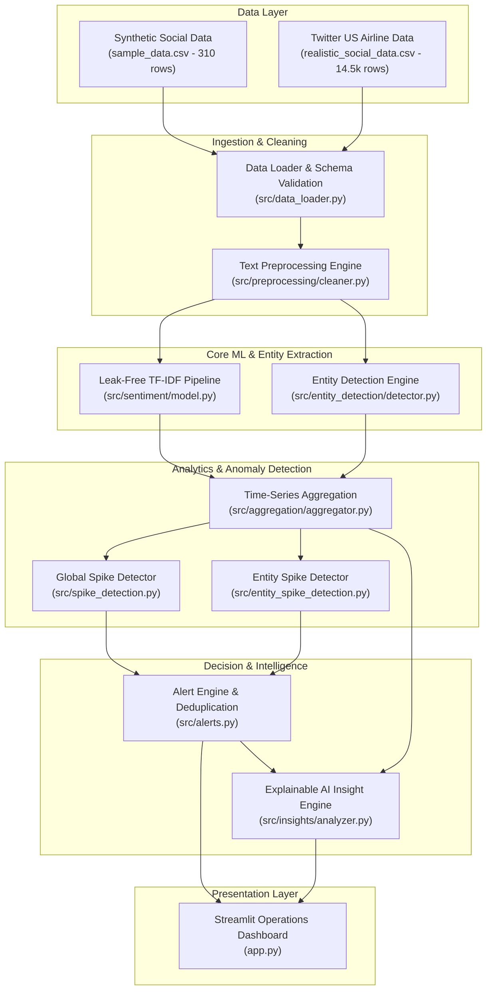

# SentimentScope AI

> **Local-first social media sentiment monitoring, entity-aware anomaly detection, and spike alerting platform with an interactive Streamlit operations dashboard.**

[](https://www.python.org/)
[](https://docs.pytest.org/)
[](https://github.com/astral-sh/ruff)
[](https://streamlit.io/)
[](LICENSE)

---

## Executive Overview

| Dimension | Details |
| :--- | :--- |
| **What problem does this solve?** | Sudden reputation crises and negative customer sentiment surges on digital channels often go unnoticed until escalations occur. Static thresholds cause alert fatigue or miss localized entity anomalies. |
| **What did I build?** | An end-to-end sentiment intelligence platform that cleans raw conversational text, trains leak-free classifiers, tracks fine-grained entities, flags statistical surges via lagged rolling baselines, generates explainable root-cause insights, and surfaces prioritized alerts in an interactive dashboard. |
| **What technologies did I use?** | **Python 3.12**, **Scikit-Learn** (TF-IDF, Logistic Regression, Linear SVM), **spaCy** (`en_core_web_sm`), **Pandas**, **NumPy**, **Plotly**, **Streamlit**, and **Pytest**. |
| **Why is it technically interesting?** | Strict leak-free pipeline architecture, empirical dual-model benchmarking, lagged rolling z-score anomaly detection ($w=3$, shifted by 1), and a deterministic explainable AI layer providing root-cause driver attribution without external black-box LLM dependencies. |

---

## Visual Tour & Screenshots

The platform features an interactive Streamlit operations center designed for incident response and sentiment analytics:

### 1. Executive Dashboard & Model Diagnostics
Captures high-level KPI cards (Total Volume, Negative %, Spikes Detected), model comparison benchmarks, and sentiment distribution charts across social platforms.


### 2. Spike Alerts Operations Center
Displays real-time incident counters (`Total`, `Critical`, `High`, `Entity Alerts`), severity distribution charts, multi-criteria filtering controls, and color-coded priority alert cards.


### 3. Structured Alert History & CSV Export
Sortable, multi-dimensional history table displaying exact timestamps, severity tiers, priority ratings, entity dimensions, observed vs. baseline counts, percentage surges, z-scores, and one-click CSV export.


### 4. Real-Time Inference Sandbox
Single-text diagnostic sandbox allowing operators to input custom social media text and evaluate live sentiment classification and continuous polarity scores.


---

## Key Features

- **Multi-Dataset Support**: Seamless runtime toggle between a multi-platform synthetic dataset (310 records with an injected anomaly) and a cleaned real-world Twitter US Airline dataset (14,485 records).
- **Leak-Free Machine Learning**: Evaluates **Logistic Regression** vs. **Linear SVM** side-by-side using stratified 80/20 train/test splits where TF-IDF vectorizers are fit exclusively on training data.
- **Dataset-Isolated Model Persistence**: Dedicated persistence paths (`sentiment_model_sample.joblib`, `sentiment_model_realistic.joblib`) prevent cross-dataset contamination.
- **Entity Detection Engine**: Identifies **Brand**, **Product**, and **Topic** dimensions using token boundary regex, curated domain lexicons, and spaCy NER fallback.
- **Time-Series Aggregation**: Resamples conversational volume and sentiment distributions into hourly and daily temporal buckets.
- **Lagged Rolling Z-Score Spike Detection**:
  - **Global Spikes**: Detects macro-level surges in negative sentiment across the entire stream.
  - **Entity Spikes**: Detects targeted negative sentiment surges isolating specific brands, products, or operational topics.
- **Severity-Graded & Prioritized Alerts**: Categorizes incidents into `CRITICAL` (Priority 1), `HIGH` (Priority 2), and `MEDIUM` (Priority 3) with composite-key deduplication.
- **Explainable AI Insight Engine**:
  - **Macro Sentiment Trajectory**: Classifies chronological movement into `Improving`, `Stable`, `Declining`, or `Highly Volatile` without lookahead bias.
  - **Multi-Factor Explainable Severity**: Deterministic scoring combining statistical z-scores, negative sentiment concentration, and volume surges.
  - **Spike Root-Cause Driver Correlation**: Automatically isolates co-occurring topic and entity drivers explaining *why* an anomaly occurred.
  - **Disproportionate Friction Hotspots**: Discovers entities driving >= 25% of total negative sentiment volume.
- **Production QA & Reliability**: Comprehensive suite of **187 automated tests** with 0 failures and automated Ruff linting.

---

## System Architecture

The following diagram illustrates the unidirectional data flow from raw ingestion to the interactive presentation layer:



---

## How the System Works

1. **Ingestion & Validation**: Validates the 5-column standard schema (`id`, `platform`, `text`, `timestamp`, `sentiment`), deduplicates records, and enforces ISO datetime standards.
2. **Text Normalization**: Strips HTML entities, decodes URLs, strips noisy `@mentions`, normalizes hashtags, and compresses repeated character elongation (e.g., `"soooo baaad"` -> `"soo baad"`) while preserving core sentiment tokens.
3. **Sentiment Classification**: Transforms text with training-fit TF-IDF vectorizers (`ngram_range=(1, 2)`, `max_features=5000`) and predicts sentiment classes with calibrated continuous polarity scores in the range `[-1.0, +1.0]`.
4. **Entity & Topic Extraction**: Scans post tokens for Brands (e.g., United, Delta, TechCorp), Products (e.g., Website, App, Flight), and Topics (e.g., Delay, Lost Baggage, Customer Service) via dictionary matching and spaCy NER fallback.
5. **Time-Series Aggregation**: Groups posts into chronological hourly or daily buckets, calculating volume, sentiment ratios, and continuous polarity averages.
6. **Lagged Rolling Anomaly Detection**: Calculates a dynamic baseline mean ($\mu$) and standard deviation ($\sigma$) over a 3-period historical window shifted by 1 period ($w=3$, `shift(1)`). An anomaly triggers when observed negative volume exceeds $\mu + 2\sigma$.
7. **Severity Grading & Deduplication**: Assigns severity (`CRITICAL`, `HIGH`, `MEDIUM`) and priority tiers (`1`, `2`, `3`) based on z-score magnitude and percentage surge above baseline. Deduplicates alerts across `(timestamp, alert_type, dimension, entity)`.
8. **Explainable AI Root-Cause Analysis**: Filters negative posts during the anomaly window, isolates the dominant co-occurring topic/brand driver, quantifies its exact volume contribution percentage, and determines the overarching macro trend.
9. **Operations Visualization**: Renders KPI cards, Plotly charts, interactive filter controls, sortable history tables, CSV download, and live prediction tools in Streamlit.

---

## Machine Learning Approach

### 1. Leak-Free Methodology
- **Stratified 80/20 Train/Test Split**: Stratified by sentiment class (`random_state=42`) to maintain consistent class proportions.
- **Pipeline Vectorization**: `TfidfVectorizer(ngram_range=(1, 2), max_features=5000)` is fit **strictly on training splits**. Validation and test inputs are transformed without refitting, eliminating data leakage.
- **Class Balancing**: Models use `class_weight="balanced"` to counteract real-world class skew (such as heavy negative class dominance in customer complaint data).

### 2. Evaluated Algorithms
- **Logistic Regression**: Linear model optimizing multinomial cross-entropy with L2 regularization (`max_iter=1000`, `class_weight="balanced"`).
- **Linear Support Vector Classifier (LinearSVC)**: Maximizes classification margin with L2 penalty and balanced class weighting (`C=1.0`, `max_iter=2000`).

### 3. Continuous Polarity Calibration
Predictions are mapped to a continuous `[-1.0, +1.0]` polarity scale:
- For **Logistic Regression**: Polarity is derived from calibrated class probabilities:
  $$	ext{Score} = P(	ext{positive}) - P(	ext{negative})$$
- For **Linear SVM**: Polarity is derived from scaled decision function margins passed through a tanh transformation.

---

## Model Comparison & Benchmark Results

Both models were evaluated across the same stratified 80/20 splits on both datasets. Performance metrics were measured using scikit-learn's `classification_report`:

### 1. Synthetic Development Dataset (`data/sample_data.csv`)
*310 total records, test size = 62*

| Model | Accuracy | Precision (Weighted) | Recall (Weighted) | F1 Score (Weighted) | Selection Status |
| :--- | :---: | :---: | :---: | :---: | :---: |
| **Logistic Regression** | **0.9839** | **0.9845** | **0.9839** | **0.9839** | **Tied** |
| **Linear SVM** | **0.9839** | **0.9845** | **0.9839** | **0.9839** | **Tied** |

*Note: High scores reflect formulaic synthetic sentences designed for initial unit testing and spike verification.*

### 2. Realistic Twitter US Airline Dataset (`data/realistic_social_data.csv`)
*14,485 deduplicated real-world records, test size = 2,897*

| Model | Accuracy | Precision (Weighted) | Recall (Weighted) | F1 Score (Weighted) | Selection Status |
| :--- | :---: | :---: | :---: | :---: | :---: |
| **Logistic Regression** | **0.7746** | **0.7906** | **0.7746** | **0.7804** | **Selected Model** |
| **Linear SVM** | 0.7746 | 0.7762 | 0.7746 | 0.7752 | Evaluated |

### Selection Rationale
**Logistic Regression** was selected as the primary production model because it achieved a higher weighted F1 score (**0.7804** vs. 0.7752) and weighted precision (**0.7906** vs. 0.7762), while natively outputting well-calibrated class probability distributions required for continuous polarity scoring and confidence assessment.

---

## Explainable AI Insight Engine

Rather than relying on external, non-deterministic LLMs or paid APIs, SentimentScope AI implements an empirical, deterministic explainable AI architecture (`src/insights/`):

### 1. Macro Sentiment Trajectory
Tracks net sentiment ($S_{\text{net}} = R_{\text{positive}} - R_{\text{negative}}$) chronologically across temporal buckets without lookahead leakage:
- **`Improving`**: Net sentiment increases by >= +0.05 from baseline to recent periods.
- **`Declining`**: Net sentiment decreases by <= -0.05 from baseline to recent periods.
- **`Highly Volatile`**: High periodic standard deviation ($\sigma \ge 0.25$) with detrended residual variance ($\sigma_{\text{res}} \ge 0.20$) or frequent sign alternations ($n \ge 3$).
- **`Stable`**: Net sentiment stays within the `[-0.05, +0.05]` boundary.

### 2. Multi-Factor Explainable Severity
Computes severity across four deterministic tiers by evaluating statistical deviation, volume scale, and negative concentration:
- **`CRITICAL`** (Priority 1): $z \ge 4.0$, OR ($z \ge 3.0$ with >= 10 negative posts and negative ratio >= 70%), OR (surge >= 100% with >= 20 negative posts and negative ratio >= 60%).
- **`HIGH`** (Priority 2): $z \in [3.0, 4.0)$, OR ($z \ge 2.0$ with >= 5 negative posts and negative ratio >= 60%), OR (surge >= 50% with >= 5 negative posts and negative ratio >= 50%).
- **`MEDIUM`** (Priority 3): $z \in [2.0, 3.0)$, OR negative ratio >= 40% with >= 5 negative posts, OR (surge >= 25% with negative ratio >= 40%).
- **`LOW`** (Priority 4): Sub-threshold fluctuations, low volume, or predominantly neutral/positive activity.

### 3. Root-Cause Driver Correlation
When an alert triggers at timestamp $t$:
- Isolates all negative posts within the corresponding time bucket.
- Identifies the primary co-occurring topic (e.g., `flight delay`, `customer_service`, `cancelled flight`) and brand.
- Computes the driver's exact percentage share of negative volume during the anomaly (e.g., *"Customer Service accounted for 68.4% of negative posts during this spike"*).

### 4. Friction Hotspots
Identifies specific brands, products, or topics accounting for >= 25% of total negative sentiment volume across the entire dataset.

---

## Statistical Anomaly & Spike Detection

```text
Lagged Rolling Window (w = 3) ──► Rolling Mean (μ) & Std (σ) ──► Z-Score = (Observed - μ) / σ
                                                                             │
┌────────────────────────────── Alert Engine ────────────────────────────────┘
│
├── Severity Tiers:      z ≥ 4.0 ──► CRITICAL  |  3.0 ≤ z < 4.0 ──► HIGH  |  2.0 ≤ z < 3.0 ──► MEDIUM
├── Priority Ranking:    CRITICAL ──► Priority 1 | HIGH ──► Priority 2 | MEDIUM ──► Priority 3
├── Percentage Surge:    ((Observed - Baseline) / Baseline) * 100
├── Deduplication Key:   (timestamp, alert_type, dimension, entity)
└── Evaluation Scopes:   Global Stream & Entity Dimensions (Brand, Product, Topic)
```

- **Leak-Free Baseline**: Baselines use `shift(1)` so the current time bucket's volume cannot bias its own rolling mean or standard deviation.
- **Adaptive Standard Deviation**: Applies an epsilon floor ($\epsilon = 0.1$) to prevent division-by-zero during zero-variance historical periods.
- **Entity Spike Isolation**: Evaluates independent rolling baselines for each identified entity, catching localized micro-spikes that would otherwise be lost in global volume.

---

## Operations Dashboard

The Streamlit dashboard (`app.py`) provides an operational interface for incident tracking:

- **Interactive Dataset Selector**: Toggle between the Synthetic Sample and the Realistic Twitter Airline dataset.
- **Granularity Control**: Resample aggregations between Hourly and Daily temporal buckets.
- **Model Comparison Table**: Review side-by-side accuracy, precision, recall, and F1 metrics with collapsible classification reports.
- **Time-Series Charts**: Interactive Plotly charts displaying sentiment volume and polarity over time.
- **Alert Operations Center**:
  - **4 Top-Level Metric Tiles**: Total Alerts, Critical Alerts, High Alerts, and Entity Alerts.
  - **Severity Bar Chart**: Visual breakdown of `CRITICAL`, `HIGH`, and `MEDIUM` alerts.
  - **Dynamic Multi-Filters**: Filter by Severity, Scope (Global vs. Entity), and Entity Dimension (Brand, Product, Topic).
  - **Multi-Criteria Sorting**: Sort by Priority (P1 first), Timestamp (latest first), Percentage Increase, or Z-score.
  - **Formatted Alert History Table**: Clean tabular layout with styled metric columns.
  - **One-Click CSV Export**: Download the filtered alert history directly to CSV.
  - **Severity-Styled Alert Cards**: Expandable alert detail cards displaying baseline volume, observed count, percentage surge, and z-scores.
- **Live Text Inference Sandbox**: Real-time sentiment prediction and polarity scoring for arbitrary text input.

---

## Dataset & Engineering Limitations

- **Historical Static Feeds**: The platform currently operates on local, static CSV datasets rather than live streaming social media APIs (due to third-party rate limits and paywalls).
- **Domain-Specific Vocabulary**: The realistic dataset is grounded in commercial airline feedback (e.g., flight delays, lost baggage, booking issues). Applying the classifier to other domains (e.g., healthcare, finance) requires domain-specific training data.
- **Correlation vs. Causation**: Root-cause driver identification isolates dominant co-occurring entities and topics during spikes, indicating statistical correlation rather than causal proof.
- **Entity Lexicon Catalog**: Entity recognition combines curated dictionaries with spaCy NER fallback. Out-of-vocabulary slang or novel brand names may require lexicon updates.
- **Sarcasm & Complex Context**: Classical n-gram TF-IDF models may occasionally misclassify subtle sarcasm or idioms compared to multi-billion parameter foundation models.

---

## Project Structure

```text
SentimentScope AI/
├── data/
│   ├── raw/
│   │   └── Tweets.csv                  # Raw Twitter US Airline Sentiment data (Kaggle)
│   ├── realistic_social_data.csv       # Cleaned real-world dataset (14,485 rows)
│   └── sample_data.csv                 # Synthetic development dataset (310 rows)
├── docs/
│   └── images/                         # Portfolio screenshots
│       ├── alert_history_table.png     # Alert history table & CSV export
│       ├── dashboard_overview.png      # KPI cards & model diagnostics
│       ├── live_prediction.png         # Live prediction sandbox
│       └── spike_alerts_center.png     # Alert cards & severity chart
├── models/
│   └── .gitkeep                        # Holds dataset-isolated .joblib models
├── scripts/
│   ├── generate_sample_data.py         # Generates deterministic sample data with spike
│   └── prepare_realistic_data.py       # Cleans & normalizes raw Twitter airline data
├── src/
│   ├── aggregation/                    # Multi-dimensional time-series aggregation
│   │   ├── __init__.py
│   │   └── aggregator.py               # Hourly/daily aggregation by entity dimensions
│   ├── data_collection/                # Ingestion loaders & normalized schema
│   │   ├── __init__.py
│   │   ├── base_loader.py              # Base loader interface
│   │   ├── instagram_loader.py         # Instagram schema normalizer
│   │   ├── json_loader.py              # Generic JSON dataset loader
│   │   ├── reddit_loader.py            # Reddit schema normalizer
│   │   ├── twitter_loader.py           # Twitter schema normalizer
│   │   └── youtube_loader.py           # YouTube schema normalizer
│   ├── entity_detection/               # Brand, Product, and Topic extraction
│   │   ├── __init__.py
│   │   ├── detector.py                 # Hybrid dictionary + spaCy NER detector
│   │   ├── dictionaries.py             # Domain entity lexicons & aliases
│   │   └── normalizer.py               # Canonical entity normalization
│   ├── insights/                       # Explainable AI insight engine
│   │   ├── __init__.py
│   │   ├── analyzer.py                 # Macro trend & spike driver correlation
│   │   ├── formatter.py                # Executive briefing cards & summaries
│   │   └── severity.py                 # Multi-factor explainable severity scoring
│   ├── preprocessing/                  # Text cleaning & normalization
│   │   ├── __init__.py
│   │   └── cleaner.py                  # HTML, URL, mention, hashtag, elongation cleaner
│   ├── sentiment/                      # Sentiment classification pipelines
│   │   ├── __init__.py
│   │   ├── evaluator.py                # Stratified model comparison & reporting
│   │   ├── model.py                    # TF-IDF + Logistic Regression / Linear SVM
│   │   └── scorer.py                   # Continuous polarity scoring
│   ├── time_series/                    # Temporal bucketing & trend generation
│   │   ├── __init__.py
│   │   └── builder.py                  # Hourly & daily sentiment bucket generator
│   ├── alerts.py                       # Alert formatting, severity, priority, & deduplication
│   ├── data_loader.py                  # CSV loading & schema validation
│   ├── entity_spike_detection.py       # Entity-level negative sentiment spike detection
│   ├── insights.py                     # Top-level explainable insights facade
│   ├── preprocessing.py                # Top-level preprocessing entry point
│   ├── sentiment.py                    # Top-level sentiment entry point
│   └── spike_detection.py              # Global time-series rolling z-score spike detector
├── tests/
│   ├── conftest.py                     # Shared Pytest fixtures & sample generators
│   ├── test_aggregation.py             # Tests for multi-dimensional aggregation
│   ├── test_alerts.py                  # Tests for alert generation, priority, & deduplication
│   ├── test_compare_models.py          # Tests for model comparison & stratified splits
│   ├── test_data_collection.py         # Tests for platform ingestion loaders
│   ├── test_data_loader.py             # Tests for CSV loading & schema validation
│   ├── test_entity_detection.py        # Tests for dictionary & spaCy entity discovery
│   ├── test_entity_spike_detection.py  # Tests for entity-specific spike detection
│   ├── test_insights.py                # Tests for Phase 7 AI insight engine & severity
│   ├── test_preprocessing.py           # Tests for regex cleaning & character compression
│   ├── test_sentiment.py               # Tests for model training, prediction, & persistence
│   ├── test_spike_detection.py         # Tests for rolling z-score calculations
│   └── test_time_series.py             # Tests for temporal bucketing & time series
├── app.py                              # Main interactive Streamlit application
├── config.py                           # Project-wide constants & settings
├── requirements.txt                    # Production & test dependencies
└── README.md                           # Recruiter-ready documentation
```

---

## Installation & Setup

### Prerequisites
- **Python 3.12+**
- **Git**

### 1. Clone & Environment Setup
```bash
# Clone the repository
git clone https://github.com/Saipriya-ekbote/SentimentScope-AI.git
cd SentimentScope-AI

# Create virtual environment
python -m venv .venv

# Activate virtual environment
# Windows (PowerShell):
.venv\Scripts\Activate.ps1
# Windows (Command Prompt):
.venv\Scripts\activate.bat
# macOS / Linux:
source .venv/bin/activate

# Upgrade pip & install dependencies
python -m pip install --upgrade pip
pip install -r requirements.txt

# Download spaCy English model (for entity detection fallback)
python -m spacy download en_core_web_sm
```

---

## Running the Application

Launch the Streamlit web dashboard locally:

```bash
streamlit run app.py
```

Once started, open your browser and navigate to:
```text
http://localhost:8501
```

---

## Quality Assurance & Testing

The codebase includes a comprehensive test harness covering every layer of the architecture:

```bash
python -m pytest -v
```

### Test Coverage Summary: **187 Tests Passed** (0 Failures)
- **Data Ingestion & Validation** (`test_data_loader.py`, `test_data_collection.py`): 22 tests verifying schema compliance, missing value handling, deduplication, and multi-platform adapters.
- **Text Preprocessing** (`test_preprocessing.py`): 18 tests covering URL removal, HTML decoding, hashtag extraction, mention stripping, and elongation normalization.
- **Machine Learning & Polarity** (`test_sentiment.py`, `test_compare_models.py`): 28 tests verifying stratified splitting, TF-IDF vectorization, model training, evaluation metrics, continuous polarity scoring, and model persistence.
- **Entity Detection** (`test_entity_detection.py`): 19 tests verifying dictionary extraction, brand/product/topic aliasing, canonical normalization, and spaCy fallback.
- **Time-Series Aggregation** (`test_time_series.py`, `test_aggregation.py`): 24 tests verifying temporal bucketing (hourly, daily), metric rollups, and multi-dimensional grouping.
- **Spike Detection & Alerts** (`test_spike_detection.py`, `test_entity_spike_detection.py`, `test_alerts.py`): 49 tests verifying lagged rolling windows, rolling mean/std calculation, z-score thresholds, entity spikes, alert formatting, priority ranking, and deduplication.
- **Explainable AI Insights** (`test_insights.py`): 27 tests verifying macro sentiment trajectory classification, multi-factor severity scoring, spike root-cause driver correlation, and executive summary generation.

### Code Quality & Linting
```bash
# Verify code formatting and linting
ruff check app.py src/ tests/

# Verify git diff formatting
git diff --check
```

---

## Future Improvements

- [ ] **Docker Containerization**: Package the Streamlit application and dependencies into a lightweight Docker image for portable cloud deployment.
- [ ] **Webhook Alert Dispatch**: Implement outbound webhook connectors (Slack, Discord, PagerDuty) to dispatch `CRITICAL` alerts to response teams automatically.
- [ ] **Transformer-Based Sentiment Comparison**: Evaluate fine-tuned lightweight Transformers (DistilBERT / RoBERTa) against classical models to benchmark accuracy vs. latency trade-offs.
- [ ] **Streaming Data Ingestion**: Integrate a streaming message queue (Apache Kafka or Redis Streams) to evaluate sentiment and rolling spikes on live micro-batches.

---

## Author & License

- **Author**: Saipriya Ekbote
- **Repository**: [https://github.com/Saipriya-ekbote/SentimentScope-AI](https://github.com/Saipriya-ekbote/SentimentScope-AI)
- **License**: Distributed under the [MIT License](LICENSE).
